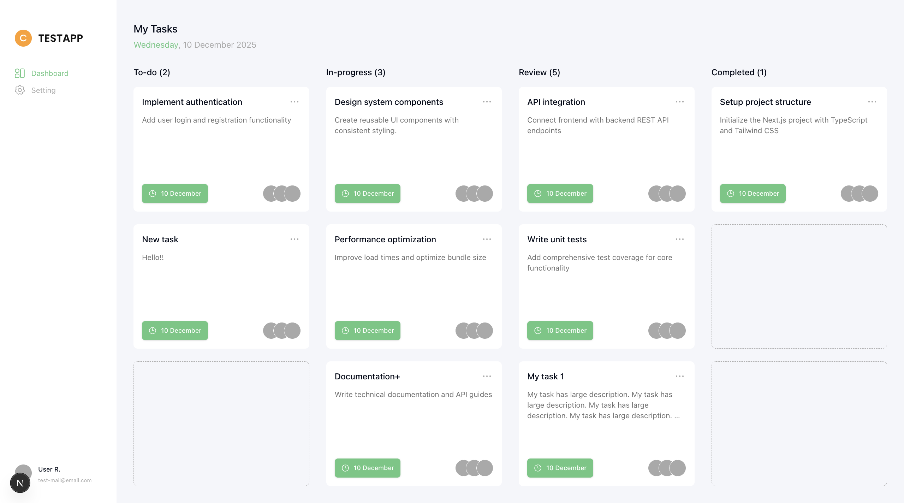
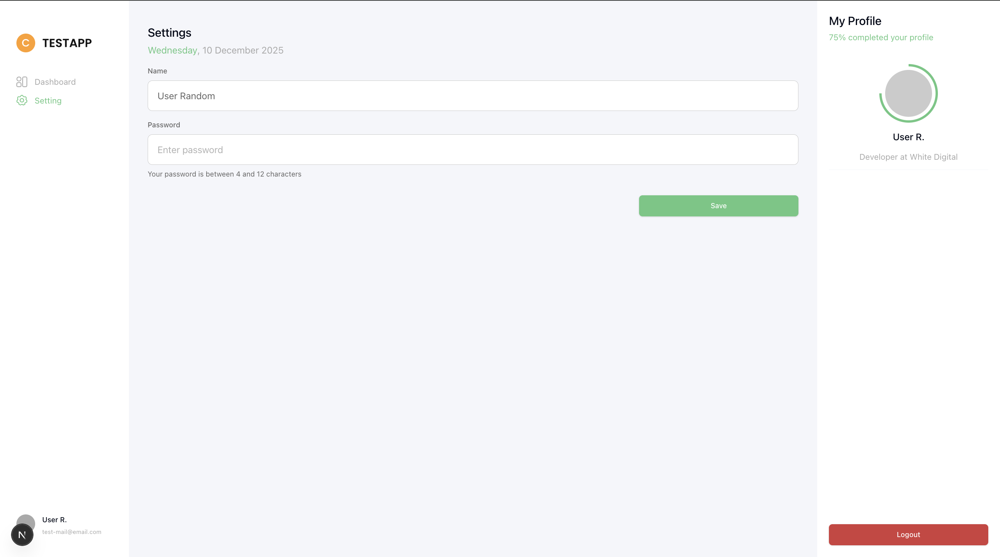

# Next Test Task App

## Overview

This test is to evaluate:

- **Layout Skills:** How you create and style layouts in NextJS.
- **API Integration:** How you connect and interact with API endpoints.
- **Git Workflow:** How you work with Git, including the amount and quality of your commits, and the clarity of your commit messages.
- **Code Quality:** Your ability to write clean, maintainable, and well-structured code following best practices.

### Tasks:

1. Create layouts for two screens as specified in the provided Figma design.
2. Connect the application to API.
3. Use shadcn/ui for UI components.
4. Use Tailwind for styling.
5. Use Tanstack Query for data fetching and state management.
6. Generate hooks for Tanstack Query.
7. Use environment variables for configuration.

### Result

- Created PR to main branch in forked repo.
- Recording for browser, showcasing both desktop and mobile screen sizes.

### Acceptance Criteria

- Two fully implemented screens as per the Figma design.
- Integration with the provided API endpoint.
- shadcn/ui as UI component library.
- Styled components using Tailwind.
- Data fetching using Tanstack Query.
- Environment variables configuration.
- Recorded videos of the application running on browser for desktop and mobile screen sizes.

### Resources

- [Figma Design Link](https://www.figma.com/design/6BexdcpNgEPE4tdeqOKB05/Next-Test-Task-App?node-id=0-1&t=h41aWaa9Ikm69JTp-1)
- [API GET REQUEST FOR TASKS](https://683857ff2c55e01d184cee44.mockapi.io/api/v1/tasks)

# Execution

---

# 📝 Next.js Test Task — White Digital

Полноценное приложение на Next.js 15 (App Router) с использованием современного фронтенд-стека:  
React, TypeScript, Tailwind, shadcn/ui, Zod, React Hook Form, TanStack Query.

# 🚀 TECH STACK

### **Core Technologies**

- ⚛️ **React 18**
- 🔵 **Next.js 15 (App Router)**
- 🟦 **TypeScript**
- 🎨 **Tailwind CSS**
- 🧩 **shadcn/ui**
- 🧹 **ESLint + Prettier**

### **State & API**

- 🔄 **TanStack Query (React Query)**
- 🎯 **Zod**
- 📝 **React Hook Form**

# 📌 FEATURES

## 🗂 Dashboard

- 🔧 Dynamic task grouping by status
- 📐 Responsive grid layout
- 🧱 Reusable task card UI
- 🎛 Task action dropdown
- 👥 Avatar group component
- 🧭 Scrollable task columns
- ⚡ Optimized data fetching via React Query

## ⚙️ Settings Page

- 🎯 Zod validation
- 🧩 React Hook Form integration
- ✏ Custom input with error states
- 🧍‍♂️ Profile panel with progress indicator
- 📱 Responsive layout

## 🧱 Reusable Components

- 🔘 CustomButton (primary / secondary)
- 🔡 CustomInput with helper/error text
- 🌀 Avatar with circular progress
- 🏷 PageTitle
- 🧩 Shared App Layout (`AppPagesLayout`)

# 🏛 ARCHITECTURE

```
/src
 ├── app
 │   ├── dashboard/
 │   │   ├── (components)/
 │   │   ├── page.tsx
 │   ├── settings/
 │   │   ├── (components)/
 │   │   ├── page.tsx
 │   ├── (general-layout)/
 │   │   ├── layout.tsx
 │   ├── layout.tsx (Root)
 │
 ├── components/
 │   ├── ui/
 │   ├── dashboard/
 │   ├── layouts/
 │   ├── common/
 │
 ├── hooks/
 ├── lib/
 ├── types/
```

# 🔌 DATA FETCHING (React Query)

## **Hook — useTasks**

```ts
export function useTasks() {
  return useQuery({
    queryKey: ["tasks"],
    queryFn: fetchTasks,
    select: (tasks) => ({
      date: getDate(tasks),
      columnsTasks: useTaskColumns(tasks),
    }),
    staleTime: 30_000,
  });
}
```

# 🌐 API — fetchTasks

```ts
export const fetchTasks = async (): Promise<Task[]> => {
  const baseUrl = process.env.NEXT_PUBLIC_API_BASE_URL;

  if (!baseUrl) {
    throw new Error("Missing NEXT_PUBLIC_API_BASE_URL environment variable.");
  }

  try {
    const response = await fetch(baseUrl, {
      cache: "no-store",
    });

    if (!response.ok) {
      const message = await response.text().catch(() => "");
      throw new Error(`API Error: ${response.status} ${response.statusText} ${message}`.trim());
    }

    const data = await response.json().catch((e) => {
      throw new Error("Invalid JSON in API response: " + e);
    });

    return data as Task[];
  } catch (err: any) {
    if (err.name === "AbortError") {
      throw new Error("API request timeout");
    }
    throw err;
  }
};
```

# 📄 PAGES

### **🖥 /dashboard**

- Displays all tasks grouped by status with a responsive grid layout.

### **⚙️ /settings**

Includes:

- form validation,
- editable profile fields,
- profile preview panel.

# 🎥 DEMO VIDEO

📌 **Видео демонстрация:**  
https://drive.google.com/file/d/15sIdYGRQxLodHueDAFcL3iePix6g1zlu/view?usp=drive_link

📁 **ZIP файл:**  
https://drive.google.com/file/d/15sIdYGRQxLodHueDAFcL3iePix6g1zlu/view?usp=drive_link

# 🖼 SCREENSHOTS

## **Dashboard**



## **Settings Page**



# ✅ INSTALLATION

```bash
pnpm install
pnpm dev
```
